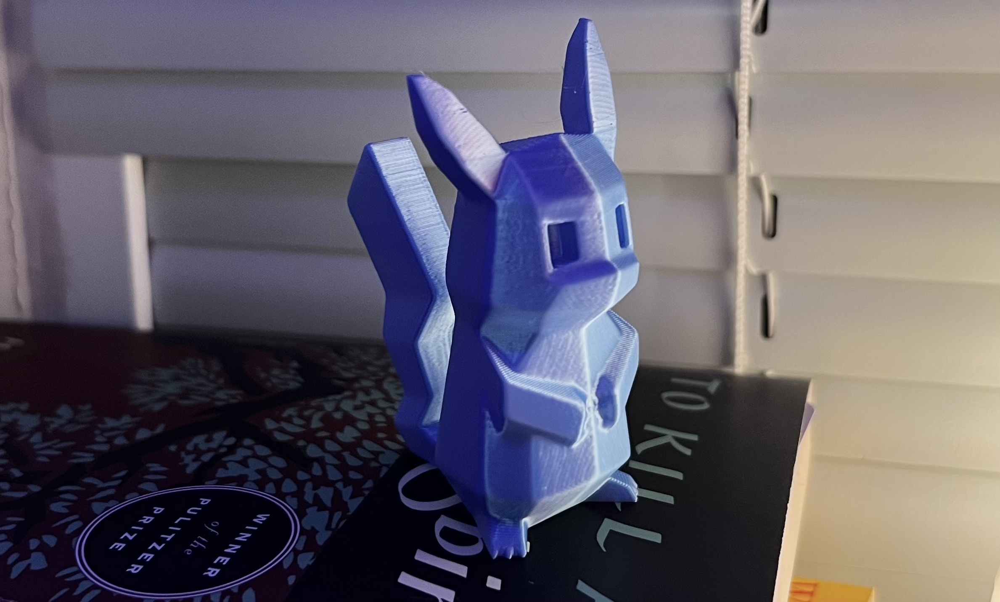
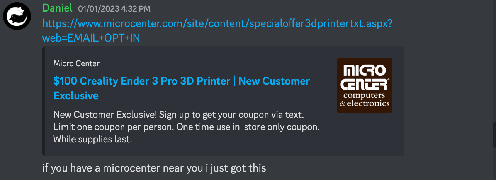
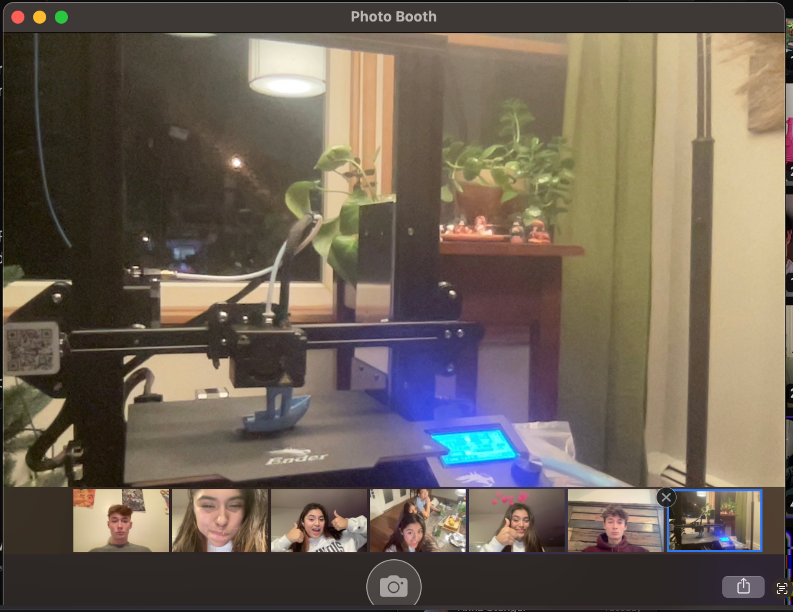
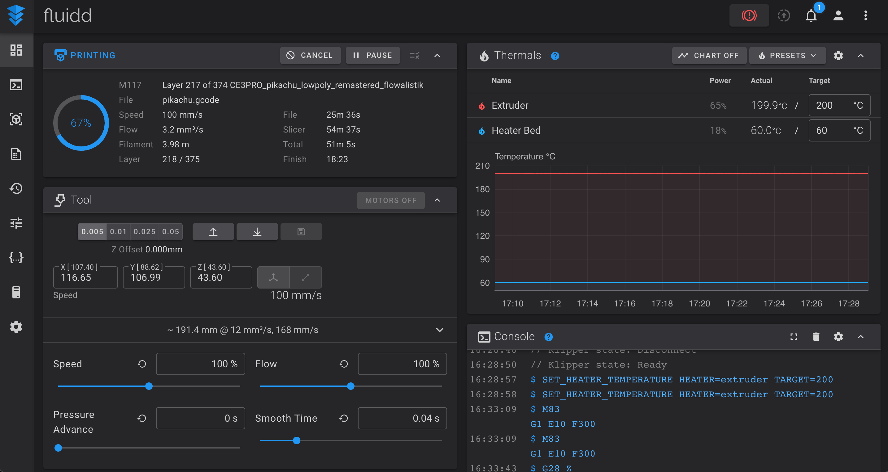
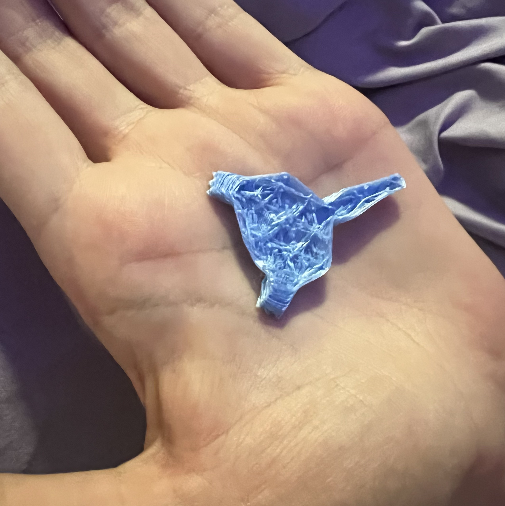
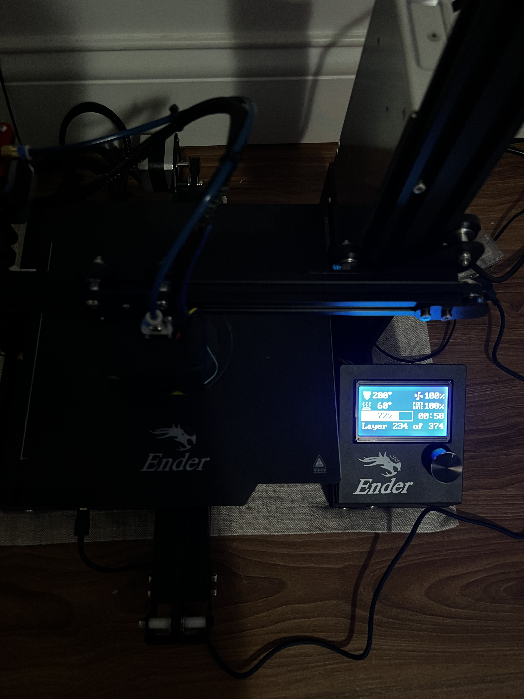
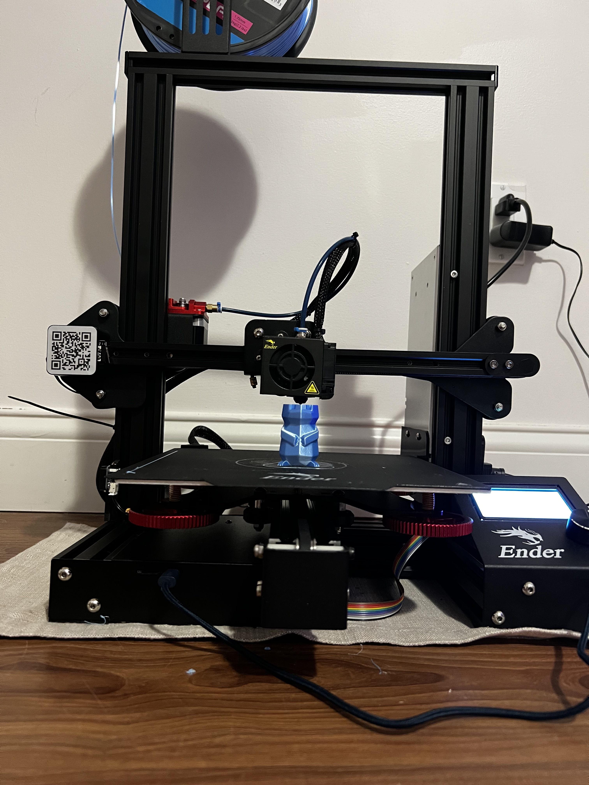

This is a short post about me purchasing, upgrading, and buying my first 3D printer.

Caption: The $144 Pikachu

## Down the <s>Rabbit</s> Pikachu Hole

My friend Daniel sent a message with a coupon code for a 3D Printer.

This is a **massive** savings! Normally this printer goes for $200 + shipping, and returns are a nightmare. On Amazon, it currently goes for [$236](https://www.amazon.com/Pro-Removable-Certified-8-66x8-66x9-84in-220x220x250mm/dp/B07GYRQVYV), so to get the printer for $100 + a filament discount is huge 🤯

The ender 3 (and it's clones) is almost unanimously the best budget 3D printer you can get for the money -- at least according to reddit experts -- until you start getting into the $400+ range, which then you might want to pick up a [Prusa MK3S+](https://www.prusa3d.com/product/original-prusa-i3-mk3s-kit-3/). I immediately went to my local microcenter and picked it up along with some blue PLA filament. I have no idea what I'm doing, and had to have a conversation with a random dude to make sure I got the right kind 😅.

## Setup

After fashioning a makeshift table, I began the setup process, following [this](https://www.youtube.com/watch?v=dQ0q9zLygTY) great guide. When it was time to level the bed, My bed was physically too low for the hotend nozzle, even with the springs extended fully. I ended up snipping a piece of plastic on the z-axis limit switch (this is what tells the printer what the lowest point it should go is) so that I could go lower than intended.

## My first print

Printed out my first benchy, and everything turned out great! 

Caption: I ❤️ photobooth!!!

I had a couple noticable flaws:

+ Zebra stripes in the print itself
  + Usually due to a not tight belt
+ Poor print quality on the bottom layer
  + I had set my bed a mm too high
+ Seperation in the middle of the boat
  + Not completely level x-axis beam

## Upgrade Time

Overall, I was pretty happy, but it was time for some upgrades 😎

Since the bed leveling process was so annoying, I purchased a BL-Touch sensor that can help me autolevel the bed (well really, the CR-Touch knockoff for only [$10](https://www.aliexpress.us/item/2251832646572674.html)). 

I also purchased a set of [upgrades](https://www.amazon.com/dp/B08L3HB4L6) from Amazon including:
+ Capricorn Bowden Tubing
+ Metal Extruder Assembly
+ Metal turn knobs and stronger bed springs

These parts are the most likely to break in the first month of printing, and I figured it would be best to replace them as soon as possible. Interestingly, all these parts are Creality branded, showing that they <s>know their printer is a piece of shit</s> care about their customers!

## Moving to Campus 😲

I transported the printer to campus with my upgrades in hand, ready to set it up again. After installing my set of upgrades (The BL-Touch will arrive later), I was ready to print (or so I thought).

I set it up on a cheap table from Walmart and realized that I forgot my usbC to microSD dongle so I literally cannot put files onto the 3D printer. So, I decided that the easiest way to solve this issue was obviously to reflash the firmware so I don't need a microSD card 👍👍👍

This idea isn't a total waste of time I swear. Now I can print sitting in my bed, 5 feet away from the printer instead of walking over!!!

By swapping out the default Marlin software with Klipper, and hooking up a Raspberry Pi 3, I would be able to print remotely from my computer, and print at a much higher speed, as I can take advantage of the tuning and processing power on the Pi. I was able to use [this great tool](https://github.com/th33xitus/kiauh) to first install Klipper, and the web UI, Fluidd. I decided on Fluidd, as the most popular option, OctoPrint, has a supposedly slow UI, and Mainsail, the default option with Klipper, can be complicated to use and setup. 

Caption: The UI, mid print

I followed [this guide](https://www.obico.io/blog/install-klipper-ender-3/) to reflash the Ender 3 firmware.

Finally, I downloaded my [model](https://www.printables.com/model/369173-low-poly-pikachu-remastered), and using [Cura](https://ultimaker.com/software/ultimaker-cura) sliced it with 100mm/s print speed.

Then I ran into a series of issues 😵

0. I forgot to plug in the Extruder motor, so the Filament wasn't feeding

1. The table was too wobbly, and ruined the print quality. The fast back-and-forth of the stepper motors was rocking the table. So I moved it to the floor.

Caption: Pikachu Monstrosity

2. After moving it to the floor, I forgot to relevel the bed, which led to nothing coming out of the printer as it was too low. I releveled the bed.

3. The hotend had backed up, and I had to unclog it.

Finally, it was all working!

Caption: The screen showing the Klipper progress

Caption: Printing the Pikachu

The Pikachu only took 1h20m to print! I am happy I decided to set up the printer and do all the modifications myself, I learned a lot about 3D printing. 

The total bill of this Pikachu  came out to:

Item|Cost
-|-
Ender 3 Pro|$99
Inland PLA Filament|$15
CR-Touch Sensor|$9
Part upgrades|$15
MicroUSB cable|$6
Raspberry PI+SD Card|owned
Total|**$144**

Thanks for reading!