Ah, the classic Google Form. So simple and innocent. And it's free! If only we could hook it up to a database to store the results. How hard could it be?

> [Narrator] He would go on to waste dozens of hours on this problem

This post is going to detail my journey this semester exploring Google Forms, as I went down rabbit holes containing 10+ year old issues, broken and undocumented APIs, and the world of Google Apps Script. 

**⚠️ Warning ⚠️** This post is mainly about my exploration with various technologies given constantly changing constraints, and not the cleanest / best solutions to problems. Take my ideas with a grain of salt 🧂

# The beginning

As a part of [Hack4Impact](https://uiuc.hack4impact.org/), we regularly work with nonprofits with budget and technology-based constraints. My team's nonprofit this semester was [Meraki](https://merakifoundation.in/). Meraki's goal is to improve education in India. One major role they play in this is surveying [Anganwadi's](https://en.wikipedia.org/wiki/Anganwadi) (rural childcard centers), and providing information about them back to the Indian government. The government then uses the data collected to inform grants, and spending decisions to improve the areas most in need.

At the start of the project, the Meraki team said that they needed a custom software solution. Meraki was collecting this important information through Google Forms, and putting it all on massive Google Sheets. It was no longer working for them, as they hit the [10 million cell limit](https://www.ablebits.com/office-addins-blog/google-sheets-limits), and were worried that creating new Sheets and Forms was not a scalable solution.


Caption: Looks like we have some work to do

# Initial constraints

## Internal Time + Developer Resources

We had planned our collaboration with Meraki to last one semester based on our initial talks about the project scope, and the main focus of the project wasn't data collection, it was data visualization. With all the data they had collected, we were interested in how we could extract interesting insights out of it.

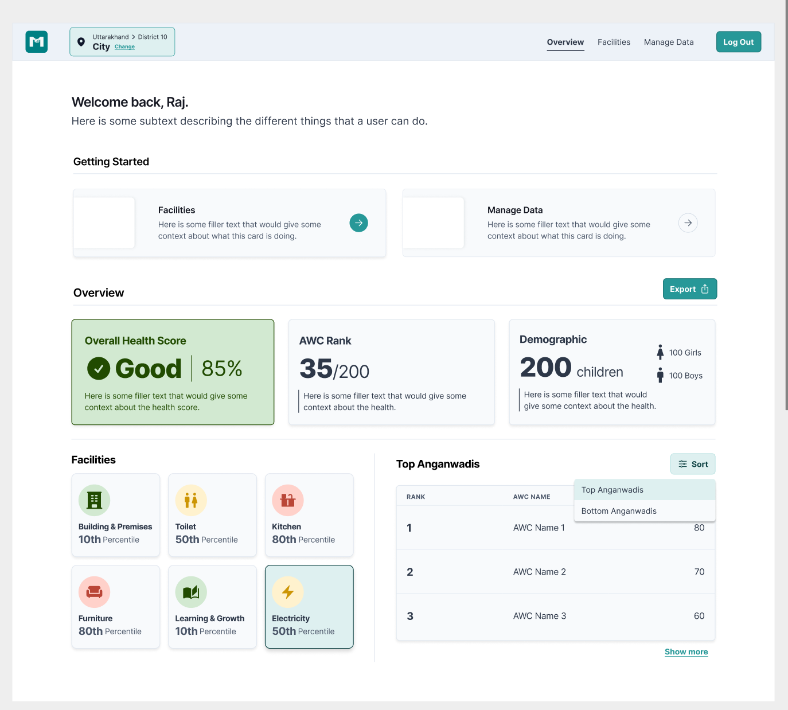
Caption: Design mockup of the platform (🤤 So sexy)

For this reason, we didn't want to spend multiple weeks creating a form builder in our chosen tech stack, taking developer resources away from the main project focus. Our teams TL ✨ (the 🐐 ~) had decided on a ~~T3~~ T2+C stack:

+ [tRPC](https://trpc.io/) + [Next.js](https://nextjs.org/) (Typescript) + ~~Tailwind~~ + [ChakraUI](https://chakra-ui.com/)
+ [Prisma](https://www.prisma.io/) (ORM)
+ [Supabase](https://supabase.com/) (Cloud DB Hosting)
+ [Vercel](https://vercel.com/dashboard) (Website hosting)
## Budget + Usability Constraints

Meraki wanted these forms to be easy to create. They wanted non-technical officials to be able to edit these forms if neccessary. Additionally, we didn't want to make them pay for a SaaS form builder. We originally considered services like [appsmith_](https://www.appsmith.com/), and [budibase](https://budibase.com/), but we felt that:

+ Google Forms was free, and sufficient for our needs
+ These tools would be complicated to use and create forms with
+ The tools cost money for cloud hosting, and self-hosting infrastructure that hundreds of thousands of preschools rely on wasn't something we were comfortable with

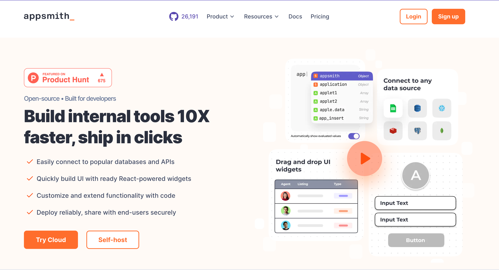
Caption: Appsmith homepage -- Showing how one can accelerate the internal tooling process

## The "AWC" Code

Each Anganwadi in India is assigned a unique "Anganwadi Center" code (AWC). This is a government id used to uniquely identify them. Meraki had been performing **no field validation** on this input on the Google Form, and had to **manually clean up data** and **contact supervisors directly** 😭 

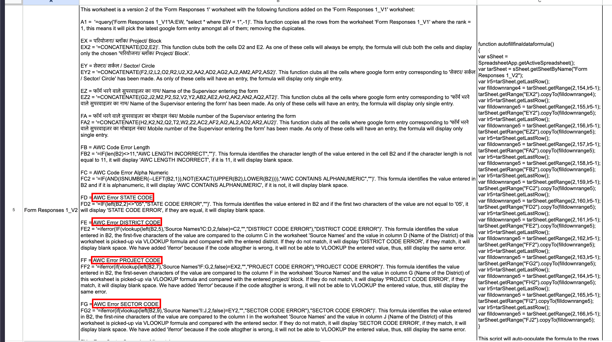
Caption: Cursed AWC Validation Formulas


These codes are made up of 5 parts. 

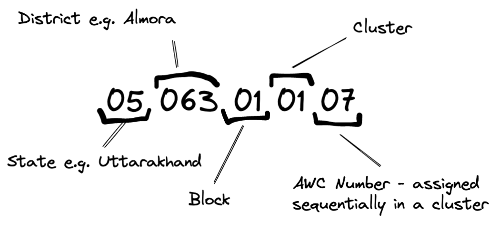
Caption: Your AWC may be apart of cluster Badechina, in block Bhaisiyachana, in District Almora, in Utterakhand.

# Developing the solution

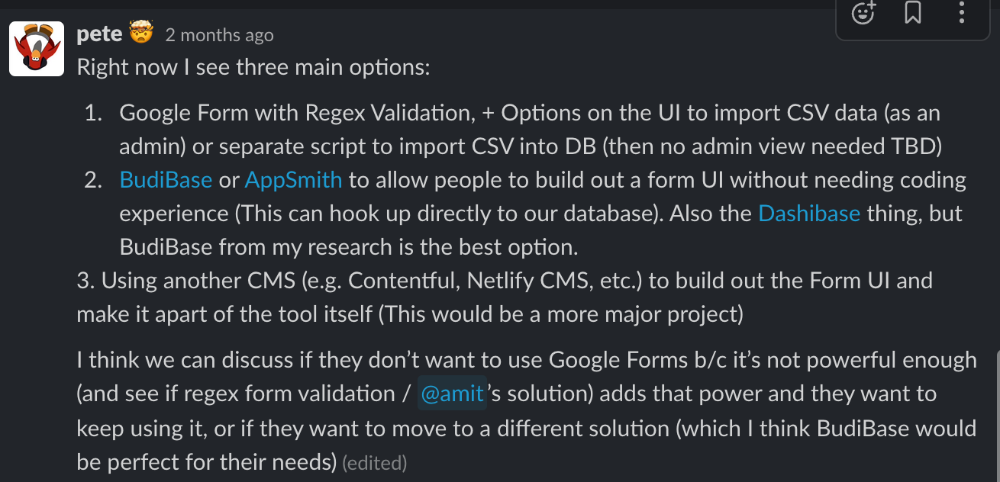

## Initial Decisions

### Regex + Google Forms

We quickly realized that Google Forms has no field validation outside of regex expressions. We quickly whipped up a regex for AWC codes, based on documentation requested from Meraki with the mappings.

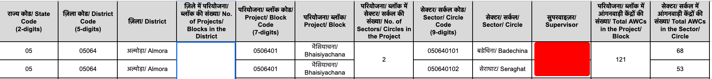
Caption: The Google Sheet contains all the information we needed.

```js
function createRegex(cells) {
  var expression = "";
  for(var i = 0; i < cells.length; i++){
      var digits = "";
      var maxDigit = Math.floor(cells[i][1] / 10);
      var lastDigit = cells[i][1] % 10;
      digits += "([0-" + (maxDigit-1).toString() + "][0-9]|["+ maxDigit.toString() + "][0-" + lastDigit.toString() + "])";
      regex = cells[i][0].slice(3) + digits;
      expression += regex + "|";
  }
  return "050(" + expression.slice(0, expression.length - 1) + ")";
}
```
Caption: So cursed

However, it appeared the regex has a hidden limitation: if you make it too long, it will crash your webpage! This wasn't going to work.

### Redirect + Google Forms
We also brought up another solution to continue using Google Forms, fill out the AWC part on our site (and do javascript validation), and then redirect to the Google Form with it [prefilled](https://support.google.com/docs/answer/2839588?hl=en&visit_id=638172636816298607-1610807482&rd=1#zippy=%2Csend-a-form-with-pre-filled-answers) in.

We designed a PostgreSQL database schema, and were all set to go. We originally decided on storing the JSON for a response directly in the table. This seemed fine, as PostgreSQL supports high performance [JSON queries](https://www.postgresql.org/docs/12/functions-json.html).

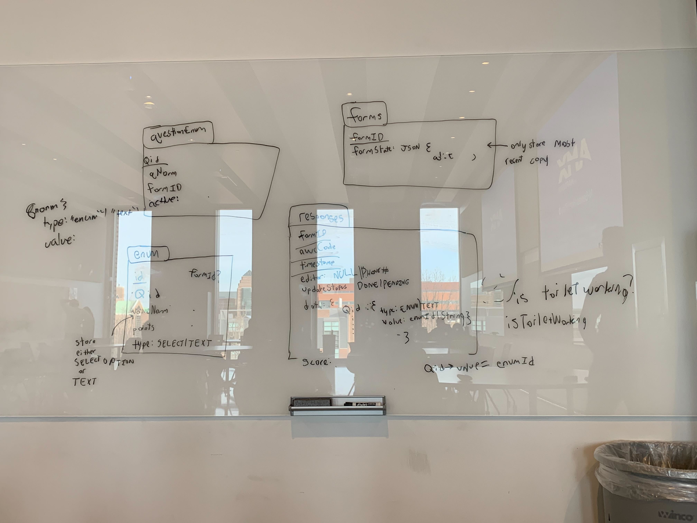
Caption: Guess whose handwriting 🤔

## Form Diffing

Meraki stated that there wasn't just multiple forms, but that the forms could **change over time**!


Caption: My mind after I receive the news

If why this is an issue isn't immediately obvious, don't worry, it wasn't to us either. It turns out that comparing two form states is really, really hard.

Imagine we have a question set up like this:

```
Do you like Google Forms?

- Yes
- I guess
- Somewhat
```

And then we change it to:

```
Do you like Google Forms?
- Yes
- Maybe
- No
```

It's unclear what happened:
+ Did we delete "I guess" or "Somewhat", or both?
+ Did we add "No"?
+ Which options were renamed?


What does Google Forms do with previous responses of "I guess"?

> Nothing 😭

For each option, Google Forms doesn't even store a unique ID, just the text of the option.

Since we are using a proper database, this problem gets worse:

+ If they rename an option, now the responses are split between the old set of options and new set of options. For a question with only 3 choices, there could now be 9 different answer choices we have to display on the UI because of the changes to the question.
+ If we delete the old options that no longer exist, now our data collection is skewed (50% Yes, 25% I guess, 25% Somewhat) becomes (100% Yes).
+ Deleting the entire question seems dangerous too - If they rename an option on a question (e.g. changing an incorrect spelling), that would wipe all previous responses for that question!

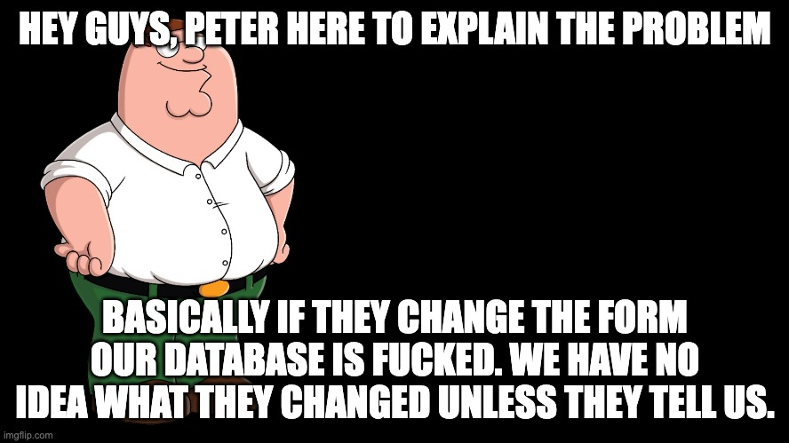

### Apps Script Plugin -- Diffing

If they are editing the form, it could be pretty simple for them to sync up the form state while they edit. So I wrote an App Script Plugin that could do just this:

<video width="480" height="320" controls muted>
  <source src="./app_script_sync.mp4" type="video/mp4">
</video>

Which works great! All you have to do is [install it](https://developers.google.com/apps-script/add-ons/how-tos/publish-add-on-overview)! Oh ... to install it you need to get it approved by Google for use by the public (unlikely), or install it under a Google Workspace using an admin account (e.g. a school might have a Google Workspace). Oh... so they can't use the plugin outside of a couple accounts 😭 this isn't gonna work.

The tl;dr of how I do this is pretty simple. I measure the `uncertainty` of a question, and also allow the user to provide a list of changes in order to lower it. If there is no uncertainty, then we can update the database schema!

```js
toAdd = [] // Options added
toDelete = [] // Options deleted
userChanges = [] // List of user changes

/*
(1) if none were deleted, and some were added, then we are sure they were added 
(2) if some were deleted, and none were added, then we are sure they were deleted
*/
if (toAdd.length === 0 || toDelete.length === 0) {
  // Not uncertain, make changes
  return;
}

let uncertainty = toAdd.length + toDelete.length;
userChanges.forEach((change) => {
  if (change.changedFrom === null && change.changedTo !== null) {
    uncertainty--;
  } else if (change.changedTo === null && change.changedFrom !== null) {
    uncertainty--;
  } else if (change.changedTo !== null && change.changedFrom !== null) {
    const oldEnum = toDelete.find((element) => {
      return element.value === change.changedFrom;
    });
    toDelete = toDelete.filter((element) => {
      return element.value !== change.changedFrom;
    });
    toAdd = toAdd.filter((element) => {
      return element.value !== change.changedTo;
    });

    if (oldEnum && oldEnum.id) {
      toUpdate.push({
        id: oldEnum.id,
        value: change.changedTo,
      });
      uncertainty -= 2;
    }
  }
});

if (uncertainty === 0) {
  // Make changes
}
```

### Apps Script Plugin -- Prefilling

Now google provides an easy prefill ID we can use to fill in the URLs for certain fields, right 😅?!? [Not exactly](https://stackoverflow.com/questions/46017170/get-entry-id-which-is-used-to-pre-populate-fields-items-in-a-google-form-url). We have to prefill every single question with every single option in order to get the IDs.

```js
// ...
case FormApp.ItemType.MULTIPLE_CHOICE:
  choices = typedItem.getChoices();
  data.prefillId = blankResponse
    .withItemResponse(typedItem.createResponse([choices[0].getValue()]))
    .toPrefilledUrl()
    .match(/entry.(\d+)=[^&]+/)[1];
  data.choices = choices.map(function (choice) {
    const url = blankResponse
      .withItemResponse(typedItem.createResponse(choice.getValue()))
      .toPrefilledUrl();
    const prefillValue = url.match(/entry.\d+=([^&]+)/)[1];
    return {
      prefillValue,
      value: choice.getValue(),
    };
  });
  break;
// ...
```

The reason we need to do this for choices now is that the AWC code also represents the cluster, block, district, and state. Meraki also wanted us to validate that their inputs for these fields lined up with the AWC code, so we need to fill in the correct choice for those questions on the form.

By now, the Apps Script was getting pretty unweildy, and was taking 2+ minutes to get the form state (since it had to spend 100+ ms per choice to get the prefill ID).

After asking a question on [StackOverflow](https://stackoverflow.com/questions/75598403/determine-google-form-question-reference-to-google-sheet-column) about associating Google Sheet columns with Google Form questions, I received feedback of "Yeah you could, but why don't you just read from the Google Form API directly?" 🤦 I'm such a fool. Why did I do all this in Apps Script?!?!?

### Google Form API -- Diffing

Google has a pretty good [API wrapper](https://github.com/googleapis/google-api-nodejs-client#readme) for node that I ended up using. Form diffing was a pretty straightforward process, with the algorithm I developed earlier for reducing uncertainty. One problem I found is that you can't get the prefill ID from the Google Form API. Luckily, it turns out that the prefill ID is just the question ID converted from hex to base 10 (this isn't documented anywhere).

I also created a UI on our platform to replace the Apps Script Add-on.

<video width="480" height="320" controls muted>
  <source src="./website_sync.mp4" type="video/mp4">
</video>

## Google Forms Abuse

After the solution was completed, our contacts pointed out a problem: users could just change the answer for AWC Code on the Google Form to a different value after it gets prefilled to the correct value. Users could change this, and their response would be lost ;\(
  
Google Forms also still doesn't have [readonly form fields](https://stackoverflow.com/questions/34364235/google-form-make-answer-field-readonly)! Insane.

Instead, I wanted to give each user a unique form response URL. 

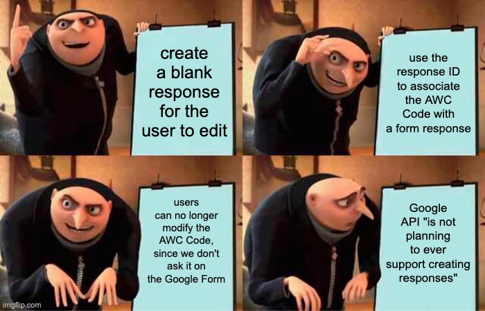

The Google Forms [API](https://developers.google.com/forms/api/guides/compare-rest-apps-script) says that

> "The REST API does not plan to support ... submitting form responses"

I made an [issue](https://issuetracker.google.com/issues/277822266) for this on the issue tracker, but seeing as Google Teams barely check this thing, I doubt it will ever happen.

Ok, what if I use Apps Script for just creating the response? I can just make a request to my Apps Script, and then return the result back!

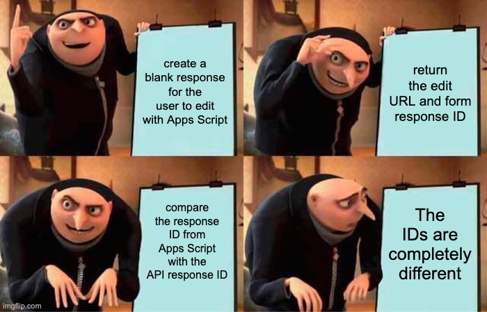

This problem is also on the [Issue Tracker](https://issuetracker.google.com/issues/232280686)! Why don't they use consistent IDs?

Instead, I noticed how incredibly time-accurate the responses were. So I came up with one final plan:

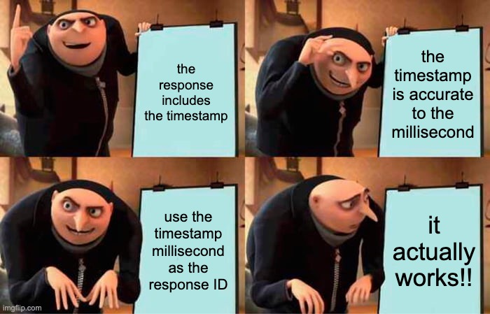

Here is the simple code that creates the responses in Apps Script:

```js
/*
  https://developers.google.com/apps-script/guides/web
  When a user visits an app or a program sends the app an HTTP GET request, Apps Script runs the function doGet(e).
*/

function doGet(e) {
  const urlId = e?.parameter['urlId'];
  const form = FormApp.openById(urlId);
  const FormResponse = form.createResponse();
  const res = FormResponse.submit();
  const id = res.getId();
  const timestamp_ms = res.getTimestamp().getTime();
  const link = res.getEditResponseUrl();
  return ContentService.createTextOutput(
    JSON.stringify({ link, id, timestamp_ms })
  );
}
```
And here is its counterpart on the server:

```js
// Make fetch request to Apps Script deployment
const formResponse = await createBlankFormResponse(form.google_id);
await ctx.prisma.aWCResponse.create({
  data: {
    awc_code: input.awcCode,
    edit_link: formResponse.link,
    timestamp_ms: formResponse.timestamp_ms,
    form_id: form.id,
    state_id: input.stateId,
    district_id: input.districtId,
    block_id: input.blockId,
    cluster_id: input.clusterId,
    update_status: UpdateStatus.PENDING,
  },
});
```

And finally, we can ingest responses like so:

```ts
// Call Google Forms API
const { data } = await client.forms.responses.list({
  formId,
  filter: `timestamp > ${after.toISOString()}`,
});

const responsesToInsert = data.responses.reduce((acc, response) => {
  // Use timestamp_ms to uniquely identify responses
  const timestamp_ms = new Date(
    response.createTime || new Date()
  ).getTime();
  // Get answers
  acc[`${timestamp_ms}`] = {
    update_status: UpdateStatus.DONE,
    questionAnswers: {
      create: questionAnswers,
    },
  };
  return acc;
}, {});

// Then, update the 'after' timestamp
await ctx.prisma.form.update({
  where: {
    id: form.id,
  },
  data: {
    last_ingest: new Date(),
  },
});
```

I had to do some authentication magic, as you can't create Apps Script using a [service account](https://issuetracker.google.com/issues/36763096). Instead of using a service account to authenticate with the Google API, I created a dummy gmail account, and got a OAUTH refresh token that I can store locally to reauthenticate if needed. People are pretty mad you can't control Apps Script with service accounts. If you figure out how to, please answer my [StackOverflow post](https://stackoverflow.com/questions/75991171/run-apps-script-webapp-in-the-context-of-a-service-account) about it 🥺

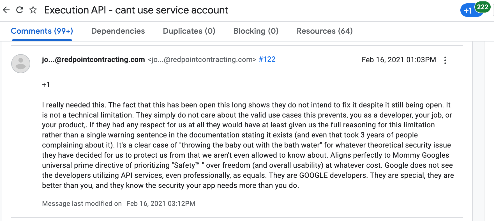
Caption: This has been a missing feature for over 7 years according to the issue tracker


# Conclusion

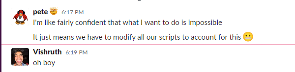
Caption: When I propose another idea

Yes, it is possible to use Google Forms as a Form Builder. But please don't.