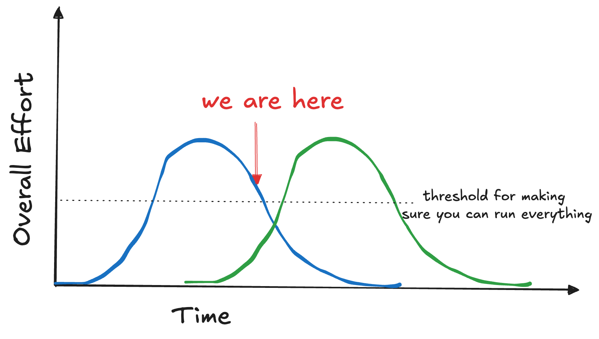
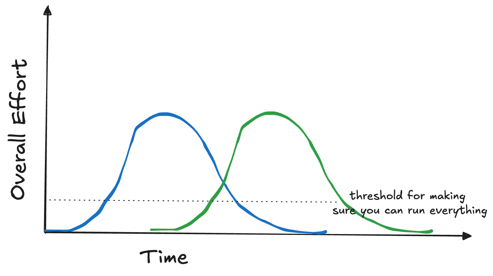
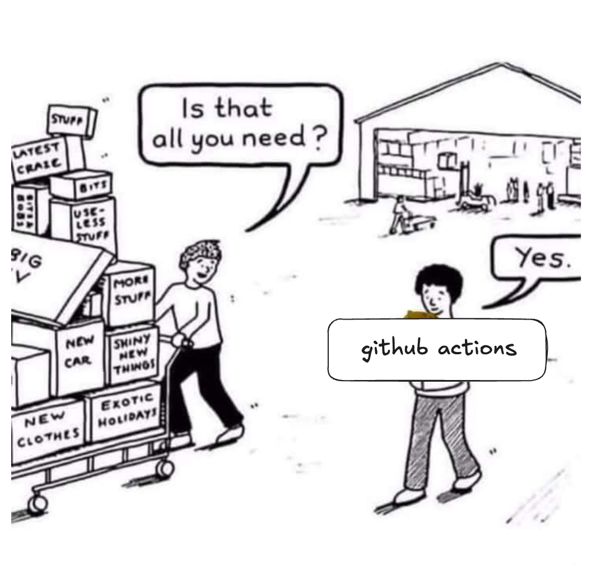

# Automation is underrated

As I have moved into my last year at UIUC, it becomes more clear that I need to do more with less time. This is especially true in any sort of managerial role, where you are spending a lot of time reminding other people to do a task, or cleaning up mistakes. 


## SIGPwny

SIGPwny, my cybersecurity club, has a leadership structure that causes some issues. All leadership promotions are initiated **by current leadership**.

In my opinion, this is a great system until existing leadership is super busy. Then we run into a tricky issue:

1. A lot of existing leadership is busy (in their senior year), and cannot dedicate time to leadership
2. We cannot inflate leadership size, so we can't promote until existing leadership steps down
3. There is not a lot of interest in putting a lot of effort into leadership until it's absolutely needed.
4. It is not intuitive to recognize (1-3), and realize that stepping down would actually help the situation, and provide a leadership role gap that needs to be filled.

So until then, SIGPwny operates leadership on a very 'skeleton crew' / best effort model.

## SIGPwny needs to be automated


This is what our timeline looks like:



Very soon, we will reach an issue where SIGPwny meetings are dropping in quality due to lack of people!

Now, if we reduce the effort needed, everything works out!



## SIGPwny gets (better) automation 😳

SIGPwny is already pretty automated:

- Changes to meetings rebuild the website
- Our Discord Bot gets rebuilt on changes
- Our CTF platform gets challenge updates pushed
- Our challenge host gets challenge updates pushed

Though we still have a lot of manual work that needs to be done.

Let's go down the list!

### Meeting reminders to students. We need to ensure everyone knows about all our meetings.

If people are SIGPwny members, they usually check our Discord or website.

  - ... Create a GitHub Action to create a discord event, and monitor it for updates.

To accomplish this, I add a [metadata route](https://github.com/sigpwny/websites/blob/main/sigpwny.com/src/pages/meetings/all.json.ts) to our Astro site that outputs a JSON file. 

```json
  {
    "id": "fa2017/general/2017-09-07",
    "data": {
      "title": "Introduction",
      "time_start": "2017-09-07T23:00:00.000Z",
      "duration": "PT1H",
      "type": "general",
      "timezone": "America/Chicago",
      "week_number": 1,
      "credit": [
        "SIGPwny"
      ],
      "featured": false,
      "slides": "/meetings/general/2017-09-07/intro.pdf",
      "tags": [
        "welcome"
      ],
      "semester": "FA2017"
    },
    "filePath": "../_global/content/meetings/fa2017/general/2017-09-07/index.mdx",
    "digest": "6e632f8a2d9f2767",
    "deferredRender": true,
    "collection": "meetings",
    "relativeSlug": "general/2017-09-07",
    "slug": "/meetings/general/2017-09-07/"
  },
```

Then, in a post-build step we can read off this file (this is much easier than parsing the Mdx + Frontmatter directly)

```typescript
const meetingsPath = path.join(__dirname, '..', '..', 'dist', 'meetings', 'all.json');
```

and then create a discord event for each meeting. To prevent duplicates, we will put the meeting url in each event description, and edit it if a duplicate is detected.


```typescript
const snowflakeEventLookup = discordEvents.reduce((o, event) => {
    // Find url in description using regex and extract the slug
    const { description } = event;
    const url = (description || '').match(urlRegex);
    if (url) {
        const slug = url[0].replace(/\/$/, '');
        o[slug] = even./; 
    }
  %20return o;%20},%20{} as Record<string, GuildScheduledEvent<GuildScheduledEventStatus>);
```


  - ... Create a subscribable calendar / gcal that people can just add to their existing calendar

Another consideration is that we want selectable team subsets that people can subscribe to.


To do this, we generate a ICS file for each meeting type combination. E.g. for my selected picture, you could subscribe to `webcal://sigpwny.com/calendar/ctf-embedded-general/apple.ics`.

As long as we have less than 7 types of meetings ( $$7! = 5040$$ routes), this provides maximum flexibility to the user.

### If people are ACM members, they only check the ACM Discord or website.

  - ... Create an ACM calendar view with linkable events

ACM was missing a calendar, so I made one for them. This has a corrosponding admin panel view (thanks to Dev for his help on this).


 -  ... Pull in ACM calendar data into the discord.

Since ACM doesn't have an event page I linked to the calendar with a URI fragment per event. This has the same logic as the SIGPwny action. E.g. 


### Reminders to prepare meetings to helpers

Helpers volunteer for meetings ahead of time, but they forget to announce it, update slides, etc.

-  ... Create a system that sends scheduled discord messages based on site data

The PoC of this is just sending a scheduled discord message. Some others on SIGPwny (Thanks Minh, George) suggested that we turn our existing discord bot, Pwnybot, stateful to keep track of scheduled pings we need.



I don't like this idea of turning it stateful because if the bot ever crashes, we lose all state. Additionally, we would need to expose the bot to the internet as a sort-of API to talk to it. Also, we already have a discord bot for managing events!

Unfortunately, GitHub does not support (out of the box) a way to schedule a GitHub actions run for the future.

The only thing that is allowed is running a workflow on a cron job timer. Also, the cron jobs can run as infrequently as 1 time per year. So as long as old cron jobs are cleaned up, this should work!


I was so happy with this idea of "Automating automation creation", that after doing some research and not finding anything that fit my needs, I created a way to generate these files in TypeScript! The repo is available [here](https://github.com/reteps/github-action-scheduler).

So to use this functionality we can have a two stage process:


1) A post-build step that generates a list of messages that we need to send, and at what time. Then, we need to create a workflow run for each time, and commit this to the repo.

```typescript
const jobs = upcomingMeetings.flatMap((meeting: any) => {
  return pingNotice.map((notice) => makeJob(meeting, notice));
})

scheduleJobs(jobs, {
  path: path.join(__dirname, '..', '..', '..', '.github', 'workflows', 'scheduled-pings.yml'),
  check: true,
  merge: false  
});
```


2) On workflow run, our desired behavior will happen!


### Maintaining documentation

- Maintaining external documentatation

I put our guides repo as a submodule of the main site. When the guides repo has a commit, I use a github action to update the upstream submodule commit.


This commit will trigger a site rebuild, at which point we copy it to the `/docs` route of the website in our `astro.config.ts`. This lets us host `sigpwny.com/docs` AND `fallctf.com/guide-2024` effectively without any major configuration steps!

```js
  vite: {
    plugins: [
      viteStaticCopy({
        targets: [
          {
            src: '../guides/pwnyctf/book/*',
            dest: 'docs'
          }
        ]
      })
    ]
  },
```

- Maintaining internal documentation

We also want the same thing for helper-only internal docs, but auth-protected it. Also we can't include this in the main site as our main submodule is public. So we can create a subdomain, e.g. `internal.sigpwny.com` to host this info.

Ideally,

1) It is hosted statically by someone (e.g. Cloudflare Pages)
2) We can use an oauth provider to wrap access to the site.

Luckily, [Cloudflare Zero Trust](https://developers.cloudflare.com/cloudflare-one/identity/) allows us to do just that, and protect the *endpoint* with auth.


## Conclusion

All these workflow improvements may seem minor, but I think the culmination of them adds us to yield a smoothly running club functional on just a 'skeleton crew'. Hopefully this inspires you to automate a little bit of your own day-to-day work!