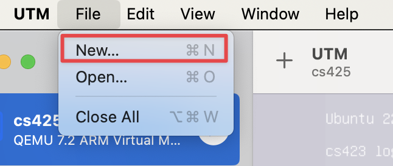

# Overview

This blog post will outline how to setup x86 GDB on M1. This isn't your run-of-the mill x86 emulation -
this is *FAST* -- using the Rosetta translation engine, instead of QEMU. Thanks to [sporks.space](https://sporks.space/2023/04/12/debugging-an-x86-application-in-rosetta-for-linux/) for the initial writeup of the `ROSETTA_DEBUGSERVER` feature!

<video width="480" height="320" controls muted>
  <source src="./demo_gdb.mp4" type="video/mp4">
</video>

## System Requirements

I am running on a M1 Chip, running MacOS Sonoma 14.0 (Build 23A339). I have had issues with Rosetta crashing on previous versions of MacOS, so I would reccomend using a later, more stable version (and still occasionally have stability issues).


## UTM / VM Setup

Download a ARMv8 / aarch64 iso like Ubuntu Desktop 22.04.3 LTS. This can be downloaded [here](https://cdimage.ubuntu.com/jammy/daily-live/current/).

Download the UTM DMG from their [Github Releases](https://github.com/utmapp/UTM/releases). At the time of writing, this is UTM 4.4.4. If you run into issues, I would reccomend using `8GB` RAM.

Then, setup your UTM VM.

First, create a New UTM VM.


Then, select Virtualize.


Then, select Linux.


Then, turn on Apple Virtualization, Enable Rosetta, and select your arm64 iso.


Follow the rest of the steps, changing your disk and RAM as you see fit.


Then, boot up into Ubuntu server. Skip/continue past all prompts that require the internet, as it will not have internet access. Additionally, check 'Install OpenSSH server'.


After you finish and reboot, go back to UTM and remove the ISO Drive so you can boot up into Ubuntu.


## Enabling Network Access

Edit the network configuration so that you can access the internet.

```bash
sudo vim /etc/netplan/00-installer-config.yaml
```

to the following contents (your network interface may be slightly different):

```yaml
network:
  ethernets:
    enp0s1:
      dhcp4: true
      nameservers:
        addresses: [8.8.8.8, 1.1.1.1]
  version: 2
```

and finally, we can download ifconfig and quickly check our host IP.

```bash
sudo netplan apply
sudo apt update && sudo apt install net-tools
ifconfig
```

## Setting up Ubuntu

You should now be able to ssh into your VM from your host with

```bash
ssh <user>@<ip>
```

And then once connected, upgrade your system and add amd64 (x86) package repositories.

```bash
sudo apt upgrade
dpkg --add-architecture 'amd64'
sudo apt install gdb-multiarch
sudo apt install libc:amd64
sudo apt install gcc:amd64
```


## Rosetta Passthrough

Then follow the steps to register Rosetta passthrough (well described in the [UTM Docs](https://docs.getutm.app/advanced/rosetta/)). 

```bash
sudo mkdir /media/rosetta
sudo mount -t virtiofs rosetta /media/rosetta
sudo echo 'rosetta\t/media/rosetta\tvirtiofs\tro,nofail\t0\t0' >> /etc/fstab
sudo /usr/sbin/update-binfmts --install rosetta /media/rosetta/rosetta \
     --magic "<COPY FROM LINK> \
     --mask "<COPY FROM LINK>" \
     --credentials yes --preserve no --fix-binary yes
```

Copy the command from the tutorial, my blog renderer messes up the mask/magic bytes.

## Your First Test

You can ensure everything is working by writing a simple `main.c` binary:

```c
#include <stdio.h>

int main() {
  puts("Hello x86!");
}
```

and compiling/running it

```bash
gcc main.c -o main && ./main
```

## Using GDB

First, make sure that ptrace trap is enabled. The reason we need to do this is explained [here](https://stackoverflow.com/a/77480313/8761914).

```
sudo sh << END
echo 0 > /proc/sys/kernel/yama/ptrace_scope
END
```

Finally, we can use GDB! In one terminal, run the target program with

```bash
ROSETTA_DEBUGSERVER_PORT=1234 ./program
```

and in a seperate terminal,

```
gdb
$ set architecture i386:x86-64
$ file ./program
$ target remote localhost:1234
```