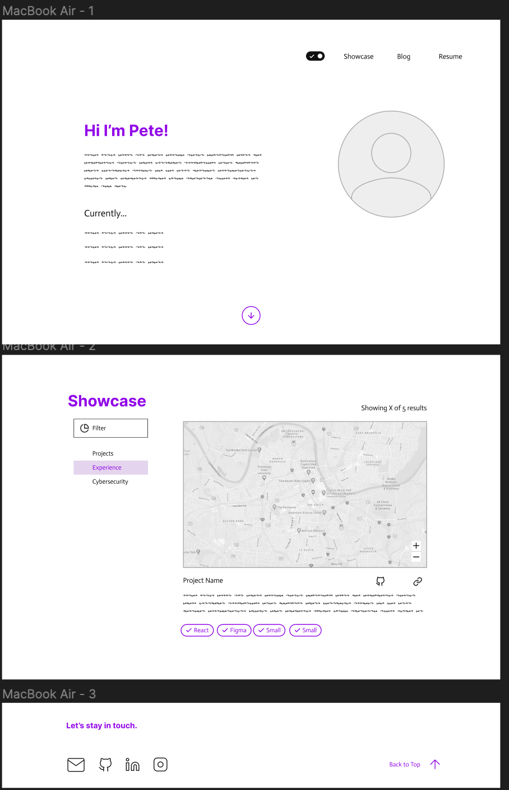

# It's alive 🥳

Finally decided to redo my site, as the last time it was made was my junior year of high school 😬

#### Random Detour

When I was looking at my old site version from [2017](https://github.com/reteps/reteps.tk) I noticed that I had a massive security vulnerability, allowing [RCE](https://github.com/reteps/reteps.tk/blob/master/src/php/kahoot_cmd.php#L15). 

```php
if ($type == "bot") {
  $call = "~/www/reteps.tk/go/kahoot-auto " . $_GET['gamepin'] . " " . $_GET['username'] . " ";
  echo($call);
  ob_flush();
}
```
Caption: I'm an idiot

Anyways, I decided to try Svelte for making it, how hard can learning an entirely new web framework for my site be, ya know? Well Svelte + TailwindCSS was amazing, and I will share just a little bit of details about how it was made.

## Development Process

First, I created a draft of my site in [Figma](https://www.figma.com/file/HlIMsWUoXULNh4qwAWwj3W/Website). The [Lo-fi Wireframe Kit](https://www.figma.com/community/file/887892609124245416) helped me prototype extremely quickly. 


Caption: My site's Figma

Firstly, I setup a barebones blog using this great guide [Build a static Markdown blog from scratch](https://joshcollinsworth.com/blog/build-static-sveltekit-markdown-blog). Then I setup a Github Actions pipeline to deploy it statically onto GH Pages, using a great [Github Action](https://gist.github.com/AndrewLester/2d3e6257d932831756226ca9a281d9b5) by [@AndrewLester](https://github.com/AndrewLester).

For the blog, I ended up using the Github Colors theme for code, plus some plugins to hyperlink headers, add LaTeX support, and add direct HTML attribute setting.

I was able to get this up and running fairly quickly, only ~2 days of coding. My most annoying bug was the blog posts themselves having a width larger than the screen width, which I fixed with `prose-a:break-words prose-code:break-words` + overriding the width, which wasn't too bad (it took me 4 hours):

```css
  .prose {
    max-width: min(100vw, 65ch);
  }
```

## Switching from medium

Since [mediumexporter](https://github.com/xdamman/mediumexporter/issues/60#issuecomment-1365921084) wasn't working for me, and it looks like an extremely recent break, I used [medium-to-hugo](https://github.com/bgadrian/medium-to-hugo) with a [small patch](https://github.com/bgadrian/medium-to-hugo/issues/6#issuecomment-939646767) to download my medium posts and convert them to markdown.

## Time Machine

I added a basic time machine feature hidden in the footer of my site. I embed my old sites as iframes, and dynamically fetch all directories with a small function:

```js
export const fetchTimeMachineYears = () => {
  const snapshots = import.meta.glob("../../../static/20[0-9][0-9]/index.html");
  const years = Object.keys(snapshots).map((path) => path.match(/20[0-9][0-9]/)![0])
  // sort years
  years.sort((a, b) => parseInt(a) - parseInt(b))
  return years
}
```
Caption: Glob all past years, and sort.

You can check it out [here](/time-machine/2020). I also added a draggable header so that it doesn't block your view.

## SEO

I wrote a small snippet of code to pull out text from my blog posts and use it as the description in SEO. 

```js
const remarkInferDescriptionMeta = () => (
  (tree, file) => {
    let description = ''
    visit(tree, 'paragraph', (node) => {
      if (description.length > 160) return
      description += toString(node) + ' '
    })

    description = description.slice(0, 160) + '...'

    file.data.fm.description = description
  }
)
```
Caption: Full Source [here](https://github.com/reteps/reteps.github.io/blob/551089e6b538e141042ab59d563afc5969dba2eb/mdsvex/infer-description.js#L6)

I am using [Svelte Sitemap](https://github.com/bartholomej/svelte-sitemap) and pushing updates to the Google Search Console with a [Github Action](https://github.com/reteps/reteps.github.io/blob/551089e6b538e141042ab59d563afc5969dba2eb/.github/workflows/pages.yml#L49).

## Optimizations

I used [vite-imagetools](https://www.npmjs.com/package/vite-imagetools) to optimize my images. I also added an aria-label to every link based on the text content of the tag:

```svelte
<script>
  export let href
  let self
  $: ariaLabel = $$restProps['aria-label'] || self?.innerText || href
  // ...
</script>
<a href={href} bind:this={self} aria-label={ariaLabel} {...$$restProps}>
```

This lets me get super snappy loadtimes, and a >90 lighthouse score!
## Future Improvements

This section may just ~disappear~ but I still need to:

+ Add a bunch more styling for my blog
+ Add some cool theme / flavor to the site
+ Fill in more content on the showcase
+ Get a job
+ Stop going to bed at 3am
+ Predicting other people reading too closely into my random blog posts