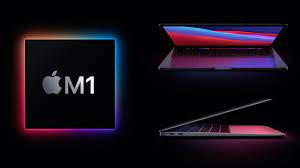
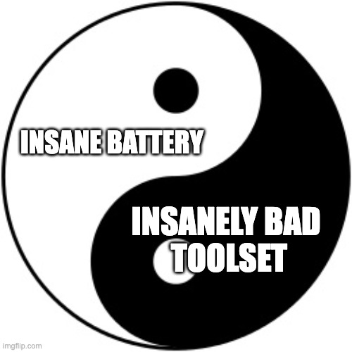
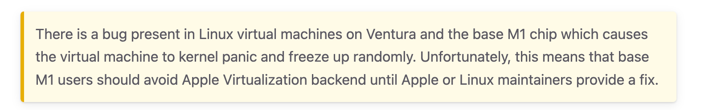
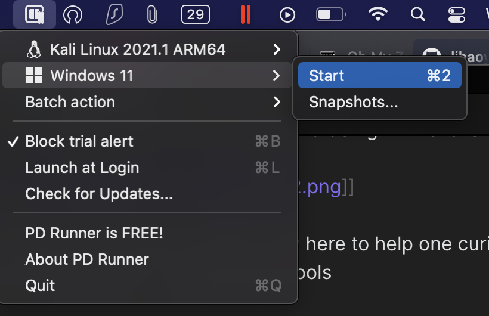

The m1 mac. Truly a tough decision for many cybersecurity professionals, as it's non-standard architecture and OS leads to a general air of skepticism about it's abilities as a security workhorse. I am going to go through my setup, and some personal items I found about the machine to inform your decision.

## Original Purchase Decisions

I debated the choice of an M1 mac for a while, but the battery and price seemed to add up, and I landed with a mid-range macbook air with 16gb RAM and 500gb storage. As a college student, I was able to get some nice discounts that brought this laptop down to a reasonable price. I believe that you should absolutely always get the 16gb of RAM, but if you backup files regularly or use any sort of cloud service, you may be able to get by on less storage.

As I compete in a lot of cybersecurity challenges (CTFs), it was paramount to getting this working well even with a questionable toolset available.

This article is short, and is mainly here to help one curious how you would use various different tools. If you don't want to read these short overview guides, I can tell you that M1 is able to do almost everything a x86 computer could, except for well-performing x86 windows.

## Standard Mac Setup

Instead of using WSL + [Windows Terminal](https://apps.microsoft.com/store/detail/windows-terminal/9N0DX20HK701) + your favorite linux distro, you will typically want:

+ [brew](https://brew.sh/) -- package manager
+ [macports](https://www.macports.org/) -- package manager for linux equivalent binaries
+ [iterm2](https://iterm2.com/) -- terminal
  + [ohmyzsh](https://ohmyz.sh/) -- terminal tweaking
  + [fig](https://fig.io/) -- An autocomplete tool
+ [Parallels](https://www.parallels.com/) -- Virtualization
  + PD Runner
+ [UTM](https://mac.getutm.app/) -- More virtual machines

## How to ... run x86 binaries?

Ok, so the main challenge we face is no x86 application support. There are a couple routes, each one with tradeoffs.

### Option 1: Tailscale

I personally have been using [tailscale](https://tailscale.com/): a 'VPN' that allows you to connect to other machines. In their words,

> Tailscale lets you easily manage access to private resources, quickly SSH into devices on your network, and work securely from anywhere in the world.

After setting this up on WSL inside my Windows 11 Desktop, I can securely SSH into a x86 linux distro whenever I need. This works great, and I haven't experienced any reliability issues. At the time of writing, you might need to apply the fix [here](https://github.com/tailscale/tailscale/issues/4833#issuecomment-1327939445) to ensure that your SSH connection works correctly. I like to use [tmux](https://github.com/tmux/tmux/wiki) to manage different tabs over SSH, and I use VSCode's [SSH feature](https://code.visualstudio.com/docs/remote/ssh) for editing files.

### Option 2: Apple Virtualization Support

The next option is to run an ARM distribution of linux, but, using the ⭐ Apple Virtualization Platform ⭐, one can run x86 binaries!

To do this, you can download a ubuntu arm64 distribution, and then follow [a guide](https://docs.getutm.app/guides/debian/) to set this up inside UTM!

Note that this doesn't work for me:

Caption: :(

And I have tried, but I get strings of crashes and reliability issues.

### Option 3: x86 Emulation

You can technically emulate x86 linux with UTM as well, but I don't reccommend it. It tends to be extremely slow and unresponsive. If you must, I reccommend using a non-GUI version, such as Ubuntu server, and giving it lots of RAM to make it barely useable.

## How to ... run Windows apps?

With Parallels + PD Runner, you can run an arm64 Windows build, and I love it ❤️. Parallels has excellent performance, and I was able to run turn based steam games, such as Civilization V with no problem. For any sort of Windows Applications that aren't from 2003 and only offer an x86 build, this is my goto option.

Caption: Simple PD Runner menu bar

However, with [Microsoft Remote Desktop](https://apps.apple.com/us/app/microsoft-remote-desktop/id1295203466), I can again leverage tailscale to access my Windows machine no matter where I am. With a fast internet connection, I do this a lot, especially since many of my niche tools I might need are already installed on it (and for any heavy computational work, e.g. password cracking)

### How do I ... run Linux programs?

Not every program will be available on mac. For this, I use a ARM64 Kali Machine inside Parallels, or tailscale again.

### My CTF Machine Usage

|Challenge type|Workflow|
--|--
|Reverse Engineering|Ghidra on M1, SSH|
|PWN|SSH, emulated ubuntu server if needed|
|Web & Crypto|M1|
|Network Analysis + Penetration Testing|Kali arm64 machine, SSH|
|Random Windows Tools|Windows arm64, Microsoft Remote Desktop|

Although some may find this flow somewhat convoluted, I will be able to argue for over 10 hours about it, compared to their mere sub 8 hour typing ceases, showing the M1 superiority.

### Conclusion

If you have a desktop or secondary x86 computer, I can highly reccommend this machine. If you don't have one, I can still reccommend this machine, but for workflows that rely on either a:

+ Reliable x86 experience
  + NOTE: This problem is likely to be fixed with software updates from apple to their Virtualization Engine in the future
+ Specific x86 Windows applications

there might be merit in other options.

