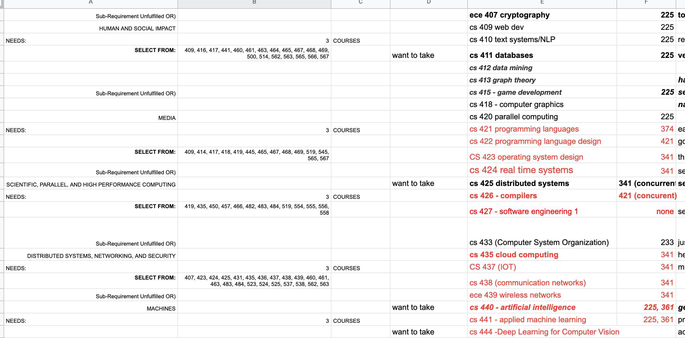
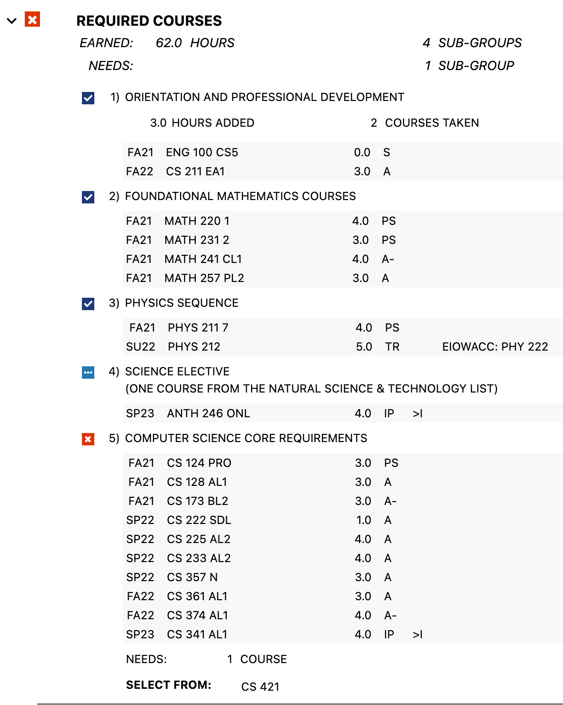
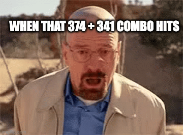
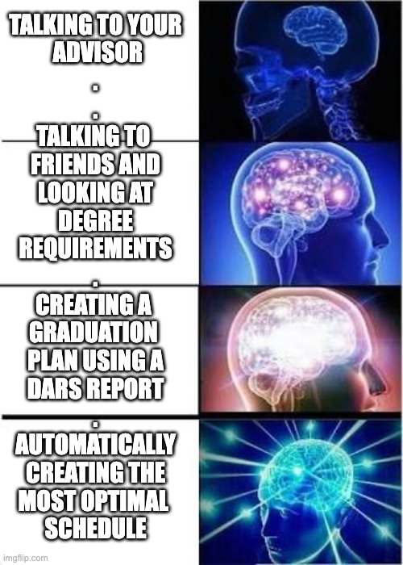
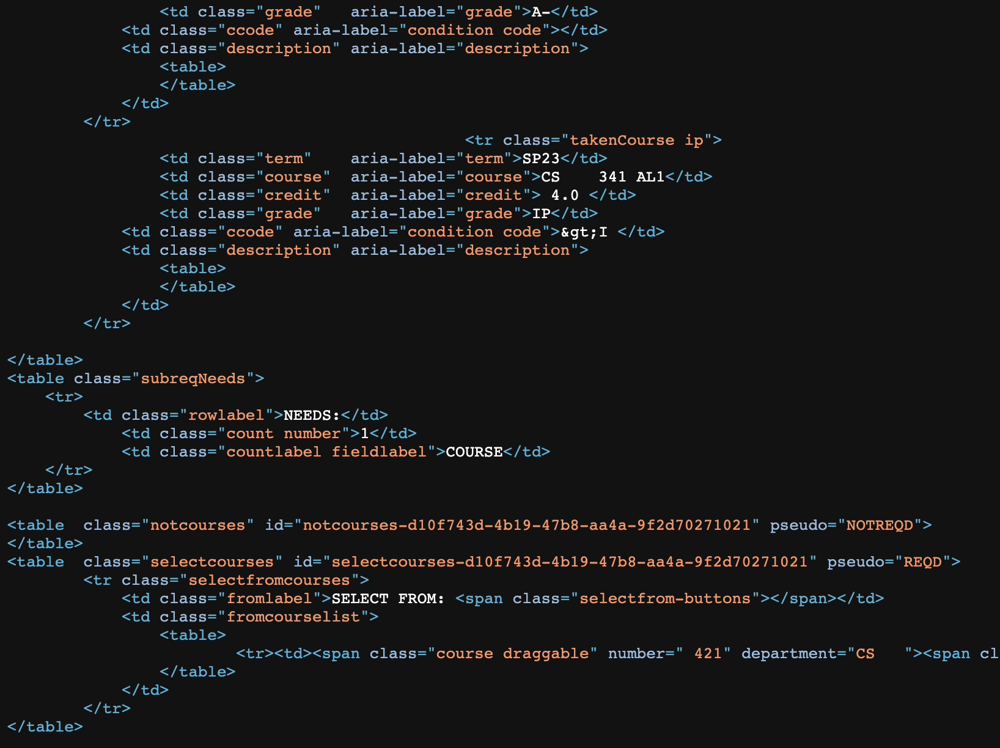

This is a semester-long project that I worked on for my [Databases class](https://alawini.web.illinois.edu/teaching/database-systems/). The project generates a valid graduation plan for you, which is easier said than done!



Caption: No more spreadsheets of degree requirements please 🤩

# Problem

As I am trying to graduate in 3 years, I have spent a fair amount of time staring at a DARS report. The [degree reports](https://registrar.illinois.edu/academic-records/dars-audit/) tell me what classes I need to take in order to graduate, and what hour/course requirements I need to complete.


Caption: An example section of my DARS report

This also means that I spend a lot of time cross-referencing the report with the available course list, and ensuring that I don't take too many hard classes together.


Caption: The cursed combo

# The Plan

What if I was able to take that DARS report, and available course information, to generate these schedules?


Caption: hehe

## Datasets

Wade Fagen-Ulmschneider (The 🐐) has released a couple of datasets:

+ The "Gen Ed" [Dataset](https://github.com/wadefagen/datasets/tree/master/geneds) details what courses satisfy which general education requirements
+ GPA [Dataset](https://github.com/wadefagen/datasets/tree/master/gpa) gets the average course GPA in each class using a series of Freedom of Information Act (FOIA) requests
+ Course Catalog [Dataset](https://github.com/wadefagen/datasets/tree/master/course-catalog) details every course section ever offered

## Making Datasets

Unfortunately, DARS reports are only offered in HTML formats. The report will need to go from something like this:


Caption: Machines hate this

Into something like this:

```json
[
  {
    "name": "REQUIRED COURSES",
    "req_number": 3,
    "OK": false,
    "needs": {
      "hours": 0.0,
      "subreqs": 1,
      "courses": 0
    },
    "subreqs": [
      {
        "name": "COMPUTER SCIENCE CORE REQUIREMENTS",
        "subreq_number": 5,
        "OK": false,
        "needs": {
          "hours": 0.0,
          "courses": 1,
          "course_list": [
            [
              {
                "number": "421",
                "department": "CS"
              }
            ]
          ]
        }
      }
    ]
  },
]
```

Additionally, we need to generate course prerequisite chains.

THIS POST IS A WORK IN PROGRESS. CHECK BACK IN LATER.

## Brief Detour ⚠️

I wanted to know what the hardest class and hardest CS class at UIUC were. I used this snippet to find them:

```python
from z3 import Optimize, Bool, Or, And, Implies, If, Sum, sat
import json
data = json.load(open('uiuc-prerequisites.json','r'))
solver = Optimize()
course_constraints = {course: Bool(f'{course}') for course in data.keys()}
for course in data.keys():
    clauses = []
    for prereq_list in data[course]:
        valid_prereqs =[course_constraints[prereq['course']] for prereq in prereq_list if prereq['course'] in course_constraints]
        if len(valid_prereqs) > 0:
          clauses.append(Or(valid_prereqs))
    
    if len(clauses) == 0:
        continue
    prereqs = And(clauses)
    solver.add(Implies(course_constraints[course], prereqs))

solver.minimize(Sum([If(constraint, 1, 0) for constraint in course_constraints.values()]))


hardest = []
for course in data.keys():
    solver.push()
    solver.add(course_constraints[course] == True)
    if solver.check() == sat:
        items = []
        model = solver.model()
        for item in model:
            if model[item]:
                items.append(item.name())

        if len(items) > len(hardest):
            hardest = items
    solver.pop()

print(hardest)
```

So the hardest class is [SE 495](https://courses.illinois.edu/schedule/2023/fall/SE/495), requiring you to take 16 other classes. By the way, make sure you are a senior whose UIN ends in an even number 😄

+ MATH 221
+ PHYS 211
+ TAM 211
+ MATH 415
+ CS 101
+ TAM 251
+ MATH 231
+ SE 311
+ SE 261
+ IE 310
+ MATH 241
+ SE 312
+ TAM 212
+ SE 310
+ IE 300
+ TAM 335
+ SE 494

And the hardest CS class is [CS 439](https://courses.illinois.edu/schedule/2023/fall/CS/439). Make sure you take **both** CS 341 and ECE 391!